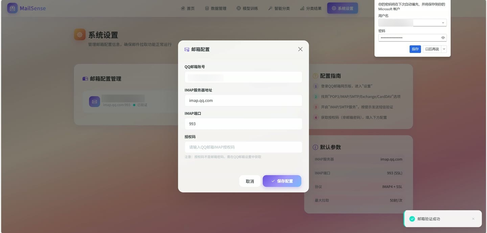

# (附文档)Python+机器学习 自适应加权朴素贝叶斯邮件分类

**技术栈**：Python、Django、机器学习、MySQL

### 系统简介

商务邮件分类系统采用 Python、Django 和 MySQL，使用 scikit-learn 的多项式朴素贝叶斯模型。代码通过 TF-IDF 提取文本特征，并对商务关键词设置自适应权重，完成邮件分类。

### 主要功能

- 构建或导入邮件语料，清洗文本、分词并管理标注样本。

- 训练分类模型，查看训练指标，并支持根据误判样本进行增量训练。

- 从邮箱抓取邮件，执行分类预测，查看、标记和导出分类结果。

- 管理邮箱连接配置；提供 Django 页面和管理后台。

### 实际技术栈

- Python、Django 3.2、Django 模板页面
- scikit-learn、TF-IDF、自适应加权朴素贝叶斯、jieba
- MySQL、HTML、CSS、JavaScript

### 随附资料

项目源码归档、毕业论文、开题报告和演示视频。

## 界面展示

---

## 获取完整源码 + 万字文档

本仓库为项目介绍页。**完整前后端源码、数据库初始化脚本、万字项目文档**，请加微信 `kangkangcode`，或访问 [codekk.top](http://codekk.top) 获取。

可作课程设计 / 毕业设计参考，支持远程部署调试。